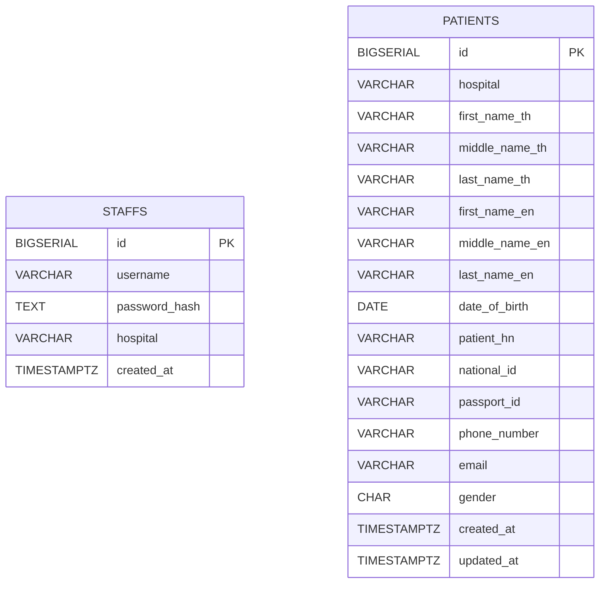

# ER Diagram

Notes:
- `staffs` unique key: `(username, hospital)`.
- `patients` unique partial indexes: `(hospital, national_id)` and `(hospital, passport_id)`.
- Access control is enforced by JWT claim `hospital` for patient search.
